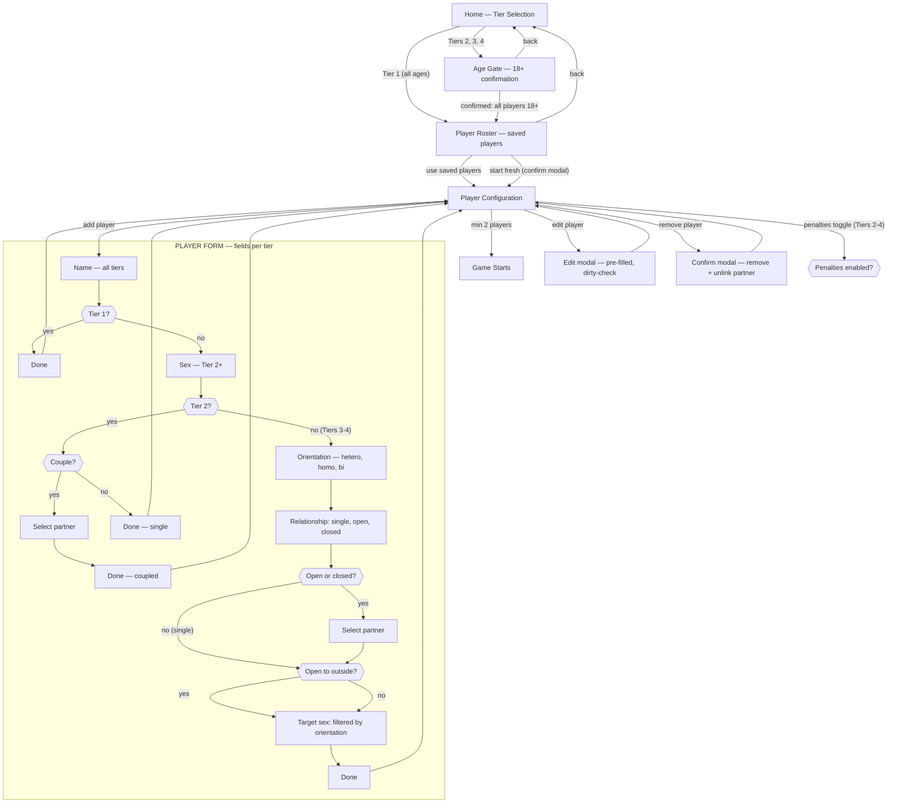
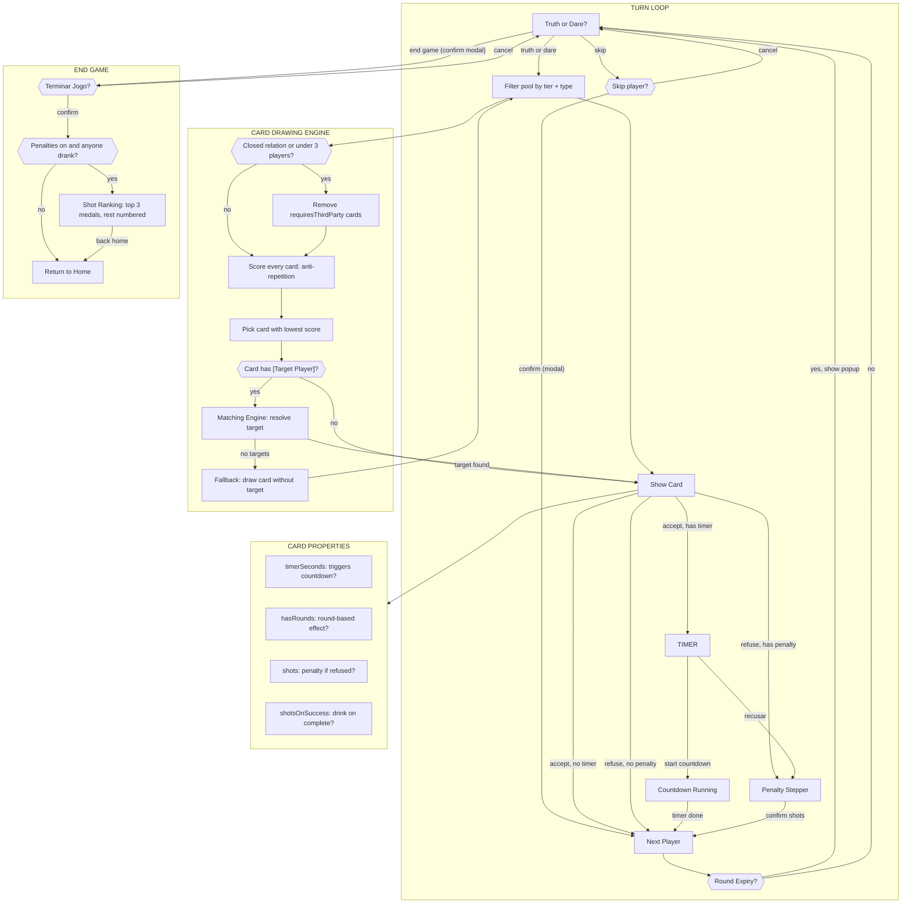

# Verdade ou Desafio 🎲

> **From family fun to the extreme — you choose the intensity.**
>
> A social party game in European Portuguese, built as a zero-dependency static SPA in TypeScript + Vite. Four escalating tiers of intensity, from family-friendly to adult content. Deployable to GitHub Pages with no server required.

---

## Table of Contents

- [Features](#features)
- [Design](#design)
- [Tech Stack](#tech-stack)
- [Getting Started](#getting-started)
- [Testing](#testing)
- [Project Structure](#project-structure)
- [Game Rules](#game-rules)
- [Architecture](#architecture)
- [Dataset](#dataset)
- [Deployment](#deployment)
- [Commit Convention](#commit-convention)
- [Licence](#licence)

---

## Features

- **800-card dataset** — 200 cards per tier (100 truths + 100 dares) with curated, non-repeating content; shots limited to 1–3 for Tiers 2–4, Tier 1 shot-free
- **Countdown timer** — dares with a time component (`timerSeconds` between 1 and 60, e.g. "durante 30 segundos") trigger a dedicated countdown screen: the player hits **⏱️ Aceitar Desafio**, then **▶️ Iniciar** to start the timer; the game is locked until it reaches 0 and then advances. **❌ Recusar** on the timer screen goes to the penalty flow (if enabled). Values > 60s are stored in the dataset but don't trigger the countdown. `timerSeconds` is pre-computed in the dataset
- **Skip player** — a **⏭️ Saltar Jogador** button on the selecting screen advances the turn without drawing a card, for players who aren't present (e.g. a couple member who left mid-dare); confirmed via a glass modal
- **[Target Player] enforcement** — all cards that involve another player use the `[Target Player]` placeholder, ensuring the matching engine selects an eligible target compatible with couple constraints (closed couples = partner only)
- **Third-party exclusion** — 57 cards are flagged `requiresThirdParty` (e.g. a three-way kiss); these are removed from the card pool for players in _closed_ relationships AND automatically when fewer than 3 players are in the game, so couple-exclusive play never surfaces a card that needs an outsider
- **4 Tier system** — from family-friendly to mature adult content (18+)
- **Age-gating** — mandatory 18+ confirmation for Tiers 2–4
- **Adaptive player registration** — fields scale with the selected tier (name → gender → orientation → relationship status); at **Tier 2** a couple-status radio (**Solteiro/a** vs **Em casal**) and a partner selector are shown — coupled players interact exclusively with their registered partner, singles only with other singles; at **Tier 3–4** the full partner dropdown, orientation, relationship-status, _open-to-outside_ toggle and target-sex selector are shown; the target-sex options are dynamically filtered by orientation — hetero shows only the opposite sex, homo shows only the same sex, bi shows all three separated; for open-relationship players the toggle also controls eligibility as an interaction target; the target-sex selector is shown once the toggle is active
- **Saved-player roster** — registered players are persisted to `localStorage` (`tod_roster_v1`) and offered for reuse at the start of every new session via a dedicated Roster screen; couples are displayed grouped with a visual connector; choosing **Começar do zero** triggers a glass confirm modal before discarding the saved roster
- **Orientation & relationship-aware matching engine** (Tiers 2–4) — at Tier 2 coupled players can only target their registered partner and singles can only target other singles; at Tiers 3–4 a full three-constraint algorithm (mutual orientation, relationship exclusivity, open-gate) ensures targets are mutually compatible; partner always bypasses all gates
- **Anti-repetition card engine** — weighted scoring prevents recently seen cards from reappearing; couples share history
- **Drink/shot penalty system** — on card refusal a penalty overlay with a `−`/value/`+` stepper appears; the player confirms how many shots they actually drank (zero is valid — nobody is forced); the **Recusar** button is always visible; the card's penalty hint (`🍺 N shots se recusar`) is only displayed when the penalty mode is active; a running shot count chip (🍺 Saldo: X shots) is shown in the turn banner, persisted per player, and reset on new game; can be disabled before starting
- **End-of-game ranking** — when a game with penalties ends and at least one player drank, a ranking screen is shown before returning home: players with shots are listed descending — the top three with shots receive 🥇🥈🥉 medals, all others show their position number (e.g. 4º) — followed by zero-shot players sorted alphabetically (dimmed); shot counts remain in `localStorage` while the ranking is on screen (so a refresh still shows the ranking correctly) and are only cleared when the player navigates to the home screen
- **Round tracker** — a round counter (🔁 Ronda N) is shown in the turn banner and increments every time the turn wraps back to the first player; round-based dare cards (e.g. _"Fala com sotaque estrangeiro durante as próximas 3 rondas"_) automatically register a timed effect, and when the target round is reached on the affected player's turn a dismissible popup announces the effect has ended, before they choose Truth or Dare
- **pt-PT inclusive notation** — card text encodes gender variants directly using the `(a)` pattern (e.g. `nu(a)`, `sozinho(a)`); no dynamic gender resolution is performed at runtime
- **Inline emphasis** — `*text*` in a card's raw text is rendered as _italic_ (`<em>`) in the UI
- **Glass confirm modals** — every `window.confirm()` has been replaced with a custom glass-styled modal (`showConfirm`): skip player, end game, start fresh roster, remove player, and discard unsaved player edits all ask for confirmation this way
- **Player editing** — each registered player chip shows an edit (pencil) button that opens a pre-filled glass modal; the modal warns via a glass confirm modal before discarding unsaved changes when closed via X, ESC, or backdrop click (Cancel and Save close immediately without prompting). Clicking the ✕ on a chip asks for confirmation before removing the player
- **Debug timer shortcut** — **Ctrl+Shift+K** (**⌘⇧K** on macOS) forces the next dare to carry a countdown timer for testing (highlights the DESAFIO button)
- **Persistent game state** — full game state is saved to `localStorage` (`tod_state_v1`) on every update, including the active theme and per-player shot counts; player roster is persisted separately in `tod_roster_v1`; first visit uses OS dark/light preference
- **Ambient background** — floating bokeh particles (tsParticles v2 via CDN) that smoothly re-colour to match the active palette when the theme changes
- **Liquid Glass dock** — physics-based floating glass toolbar (always visible) with a **Temas** button (colour palette) and a **Definições** button (dark/light mode toggle, frosted glass toggle + in-game wiki)
- **Dark / light mode** — respects OS preference on first visit; toggle via the dock **Definições** menu; persisted across sessions
- **PWA installable** — add to home screen on Android, iOS, macOS and Windows; works offline via Service Worker; **auto-reloads** when a new version is deployed — a `controllerchange` listener in `main.ts` triggers `location.reload()` the moment the new SW takes control, so players always get the latest version without manually reopening the app
- **10 vivid colour themes** — 5 palettes (Violeta, Oceano, Âmbar, Rosa, Floresta) × 2 modes (light / dark); all with saturated, vibrant tones and per-palette glass tokens
- **Liquid toggle switches** — all binary controls (dark mode, frosted glass, penalties, open-to-outside) use a morphing goo animation toggle whose colour follows the active theme
- **Frosted glass mode** — optional heavier blur/tint on all glass surfaces, toggled from the Definições menu
- **Mobile-first responsive design** — no vertical or horizontal scroll at the page level; content areas scroll internally where needed
- **Landscape optimisation** — wider containers and compact layouts on rotated devices
- **WCAG AA colour contrast** — all 10 themes verified for interactive element contrast

---

## Design

The UI uses a **Liquid Glass** design system — a physics-based refraction effect that simulates real optical glass through SVG displacement maps computed from Snell's law. Each glass surface (dock, menus, modals) has four stacked layers: a displacement+blur backdrop, a colour-mix tint, an inset edge-shine, and the interactive content. Toggle switches use a goo/morphing animation via SVG colour-matrix filters, and their hue automatically follows the active palette. All 10 themes (5 palettes × light/dark) are built with vibrant, saturated tones and a two-layer CSS cascade: a shared dark-base selector followed by per-palette variable overrides, maintaining WCAG AA contrast across all combinations. A tsParticles (v2) ambient background adds depth with soft bokeh particles that re-colour on every theme change.

Design reference: [kube.io/blog/liquid-glass-css-svg](https://kube.io/blog/liquid-glass-css-svg/)

---

## Tech Stack

| Layer      | Choice                        | Notes                                                                                                                    |
| ---------- | ----------------------------- | ------------------------------------------------------------------------------------------------------------------------ |
| Language   | TypeScript 5.7                | Strict mode, `noUncheckedIndexedAccess`, `noImplicitOverride`                                                            |
| Bundler    | Vite 6 + vite-plugin-pwa      | JSON imports, HMR, esbuild minification, PWA / Service Worker (`registerType: 'autoUpdate'` + `controllerchange` reload) |
| UI         | Vanilla DOM                   | No framework — pure TypeScript DOM manipulation                                                                          |
| Styling    | CSS Custom Properties         | Mobile-first, tokenised design system, dark/light theming                                                                |
| State      | Hand-rolled reactive store    | Observer pattern, `localStorage` persistence                                                                             |
| Testing    | Vitest 4 + jsdom              | Unit tests for engine and state layers (`src/__tests__/`); `npm test` / `npm run test:coverage`                          |
| DX tooling | Husky + commitlint + Prettier | Pre-commit formatting, conventional commit enforcement                                                                   |
| CI/CD      | GitHub Actions                | Three-job pipeline on push to `main`: **Test → Build → Deploy** to GitHub Pages                                          |

---

## Getting Started

### Prerequisites

- **Node.js** ≥ 18
- **npm** ≥ 9

### Installation

```bash
git clone https://github.com/<your-username>/truth-or-dare.git
cd truth-or-dare
npm install
./setup.sh   # creates .husky/ hooks — run once after cloning
             # without this step, commitlint and Prettier pre-commit checks are NOT active
```

### Development server

```bash
npm run dev
```

Opens at `http://localhost:5173` with hot-module replacement.

### Production build

```bash
npm run build
```

Output goes to `dist/`. TypeScript is type-checked before bundling (`tsc --noEmit && vite build`).

### Preview production build locally

```bash
npm run preview
```

Opens at `http://localhost:4173`.

---

## Testing

The project uses **Vitest 4** for unit testing, running in a **jsdom** environment.

### Running tests

```bash
npm test                # single run (used in CI — blocks deployment on failure)
npm run test:watch      # interactive watch mode during development
npm run test:coverage   # v8 coverage report (text + HTML + lcov)
```

### Test structure

```
src/__tests__/
├── engine/
│   ├── cardFormatter.test.ts    # formatCardText, sexLabel, orientationLabel, relationshipLabel
│   ├── datasetLoader.test.ts    # loadCards (real dataset.json), filterCards
│   ├── matchingEngine.test.ts   # getEligibleTargets + pickRandomTarget — all tiers, orientations,
│   │                            #   closed/open couples, targetSex edge cases
│   └── repetitionEngine.test.ts # cardKey, recordCardShown, selectCard (scoring + history)
├── state/
│   ├── actions.test.ts          # Every Action pure-updater function in isolation
│   ├── store.test.ts            # GameStore construction, subscribe/unsubscribe, update,
│   │                            #   localStorage persistence, roster persistence
│   └── timerAndSkip.test.ts     # Timer flow (accept → start → complete) + skipPlayer action
├── ui/
│   ├── confirmModal.test.ts     # showConfirm — glass modal creation, confirm/cancel/backdrop
│   └── rankingScreen.test.ts    # Ranking screen — medal logic, ordering, shot display
└── fixtures/
    ├── cards.ts                 # Hand-crafted Card objects covering all 4 tiers and both types
    └── players.ts               # Player fixtures: Tier 1/2, hetero/homo/bi, open/closed couples
```

Coverage is configured to include `src/engine/**`, `src/state/**`, and `src/ui/**`.

---

## Project Structure

```
.
├── src/
│   ├── data/
│   │   └── dataset.json       # 800 cards (bundled at build time)
│   ├── engine/
│   │   ├── glassDistortion.ts  # Physics-based SVG displacement map (Liquid Glass)
│   │   ├── datasetLoader.ts    # Loads & flattens dataset.json; filterCards utility
│   │   ├── cardFormatter.ts    # Card text formatter: [Target Player] substitution + HTML escaping
│   │   ├── matchingEngine.ts   # Eligible target selection (Tiers 2–4)
│   │   └── repetitionEngine.ts # Anti-repetition weighted card selection
│   ├── __tests__/
│   │   ├── engine/
│   │   │   ├── cardFormatter.test.ts
│   │   │   ├── datasetLoader.test.ts
│   │   │   ├── matchingEngine.test.ts
│   │   │   └── repetitionEngine.test.ts
│   │   ├── state/
│   │   │   ├── actions.test.ts
│   │   │   └── store.test.ts
│   │   └── fixtures/
│   │       ├── cards.ts         # Card fixtures for all tiers
│   │       └── players.ts       # Player fixtures (Tier 1–4, all orientations/statuses)
│   ├── state/
│   │   └── store.ts           # Reactive store, all Actions, localStorage persistence
│   ├── types/
│   │   └── index.ts           # All shared domain types
│   ├── ui/
│   │   ├── router.ts          # GamePhase → screen factory, focus management
│   │   ├── settingsPanel.ts   # Glass dock + settings platform-menu + wiki modal
│   │   ├── confirmModal.ts    # Glass-styled confirm dialog (returns Promise<boolean>)
│   │   ├── domHelpers.ts      # Shared DOM utilities (el, createGitHubLink, escapeHtml)
│   │   └── screens/
│   │       ├── homeScreen.ts  # Tier selection grid
│   │       ├── ageGateScreen.ts # 18+ confirmation (Tiers 2–4)
│   │       ├── rosterScreen.ts  # Saved-player roster recovery screen
│   │       ├── setupScreen.ts   # Adaptive player registration (couple status at Tier 2; full fields at Tier 3–4)
│   │       ├── gameScreen.ts    # Truth/Dare selection + card reveal + penalty overlay
│   │       └── rankingScreen.ts # End-of-game shot ranking (shown when penalties > 0)
│   ├── styles/
│   │   └── main.css           # Full stylesheet — tokens, components, landscape queries
│   ├── main.ts                # Application entry point
│   └── vite-env.d.ts          # Vite type declarations
├── index.html                 # SPA shell
├── vite.config.ts             # Vite configuration (base path, esbuild target, PWA / Service Worker)
├── public/
│   ├── pwa-512.svg            # Master PWA icon source (used to generate raster icons)
│   ├── pwa-192x192.png        # PWA icon — standard
│   ├── pwa-512x512.png        # PWA icon — large
│   ├── maskable-icon-512x512.png # PWA icon — maskable (Android adaptive)
│   ├── apple-touch-icon-180x180.png # iOS home-screen icon
│   └── favicon.ico            # Browser tab favicon
├── tsconfig.json              # TypeScript configuration (strict, ES2021)
├── tsconfig.node.json         # TypeScript config for vite.config.ts (Node context)
├── package.json
├── .commitlintrc.json         # Conventional Commits enforcement
├── .lintstagedrc.json         # Prettier on staged files
├── .prettierrc                # Prettier options
└── .github/
    └── workflows/
        └── deploy.yml         # GitHub Actions: test → build → deploy to GitHub Pages
```

---

## Game Rules

### The 4 Tiers

| Tier | Name                     | Age Restriction | Shot Penalties | Description                                                                                                                                                                                 |
| ---- | ------------------------ | :-------------: | :------------: | ------------------------------------------------------------------------------------------------------------------------------------------------------------------------------------------- |
| 1    | 🌟 Family Fun            |        ✗        |       ✗        | Light questions and fun dares — suitable for all ages                                                                                                                                       |
| 2    | 🎉 Night with Friends    |       18+       |       ✓        | Spicier content about personal life, secrets and embarrassing moments; includes couple status — coupled players interact exclusively with each other                                        |
| 3    | 🔥 Where the Heat Begins |       18+       |       ✓        | Adult content with physical challenges between players; sexual-orientation-based targeting engine                                                                                           |
| 4    | 💀 Extreme               |       18+       |       ✓        | Intense adult content for groups who are fully comfortable with each other; also ideal for couples wanting a spicy night — third-party cards are automatically excluded with only 2 players |

### Turn Flow

1. The current player's name is displayed.
2. They choose **VERDADE** (Truth) or **DESAFIO** (Dare).
3. A card is drawn and displayed. The target player (if any) is resolved automatically. If penalties are enabled, the card shows `🍺 N shots se recusar`.
4. The player either completes the challenge (✅ Feito! — or ⏱️ **Aceitar Desafio** when the card carries a countdown timer) or refuses (❌ Recusar). Accepting a timed challenge opens the **countdown screen**, where the player presses ▶️ **Iniciar** to start the timer; the turn advances only when it reaches 0. Recusing on the timer screen routes to the penalty flow (if enabled).
5. Refusing triggers a penalty overlay with a stepper. The player adjusts the quantity to what they actually drank (can be zero) and confirms. Nobody is forced to drink — the game records only what is confirmed.
6. The turn passes to the next player in registration order.

   The selecting screen also offers a **⏭️ Saltar Jogador** button (confirmed via glass modal) to advance the turn without a card — useful when a player isn't present, e.g. a couple member who left mid-dare.

   Between steps 6 and 7, if the turn wraps back to player 0, the **round counter increments**. Before the next player can act, the game checks for any round-effect expirations for that player and shows a popup if any are found.

7. When the game ends (via **Terminar Jogo**), if penalties were active and at least one player drank, a **ranking screen** is shown with all players sorted by shots consumed before returning to the home screen.

### Penalty System

Each card in Tiers 2–4 carries a shot count (1–3 in the source data). Tier 1 has no shots. Refusing a card triggers a full-screen penalty overlay with a `−` / value / `+` stepper defaulting to the card's shot count. The player adjusts the quantity to what they actually drank (including zero) and confirms — the game records only the confirmed amount. The **Recusar** button is always shown; if the card has no shot count, refusing simply advances the turn.

The `🍺 N shots se recusar` hint on the card face is **only rendered when the penalty mode is active** — games with penalties disabled show a clean card.

A **shot count chip** (🍺 Saldo: N shots) appears in the selecting-phase turn banner showing the player's session total. It is stored in `shotCounts` (part of `GameState`) and persisted to `localStorage` throughout the active game, including while the ranking screen is visible (so a refresh on the ranking screen restores the correct data). Shot counts are only erased when `confirmEndGame` resets the full state on return to home.

At the end of a game where penalties were on and at least one player drank, a **ranking screen** is shown listing all players: those with shots sorted descending (the top three with shots get 🥇🥈🥉 medals, all others show their position number e.g. 4º), then zero-shot players sorted alphabetically (dimmed). The **Voltar ao Início** button resets the full state and returns to the home screen.

The feature can be disabled in the setup screen before the game starts — useful for alcohol-free play.

### Round Tracker

Each game starts at **Ronda 1**. The round counter increments every time the turn wraps back to the first registered player.

A small **🔁 Ronda N** badge is visible in the turn banner at all times during the game (both in the selecting and card-revealing phases).

Some dare cards carry a **round duration** — for example _"Fala com sotaque estrangeiro durante as próximas 3 rondas."_ When a player accepts such a card, the game registers a timed effect storing:

- the player it applies to
- the round it was accepted (`triggerRound`)
- the round it expires (`targetRound = triggerRound + roundsCount`)

When it is that player's turn and the current round equals or exceeds `targetRound`, a **dismissible popup** appears before they choose Truth or Dare, announcing the effect has ended. Multiple simultaneous expirations for the same player are shown together in one popup.

Cards with round durations carry two additional dataset fields: `roundsCount` and `hasRounds`.

### Countdown Timer

Some dare cards carry an explicit time duration (e.g. _"Dança como um robô durante 30 segundos."_). When a player accepts such a card, the accept button reads **⏱️ Aceitar Desafio** (instead of ✅ Feito!) and opens a dedicated **countdown screen**:

1. The **countdown screen** appears showing the challenge text and a large timer display.
2. The player presses **▶️ Iniciar** to start the countdown, or **❌ Recusar** to back out (which routes to the penalty flow if enabled).
3. Once the timer starts, the game is **locked** — no advancing, no other actions.
4. When the timer reaches **0**, the game automatically advances to the next player.

Only cards with `timerSeconds` between 1 and 60 trigger the countdown; values greater than 60 are stored in the dataset but don't trigger a timer. The `timerSeconds` value is pre-computed in the dataset. Round-based cards (e.g. _"durante as próximas 3 rondas"_) are excluded from the timer system and use the round-effect tracker instead.

### Matching Engine (Tiers 2–4)

When a card contains `[Target Player]`, the engine selects an eligible target based on the active tier.

**Tier 2** applies a single couple constraint:

- Players registered as **Em casal** (with a `partnerId`) interact exclusively with their registered partner.
- Players registered as **Solteiro/a** (no `partnerId`) can only target other singles. Coupled players cannot be targets of singles at this tier. A coupled player whose partner is absent gets an empty target pool (falls back to no-target cards).

**Tiers 3–4** apply three constraints in sequence:

1. **Mutual orientation** — only pairs where both players are attracted to the other's gender are eligible.
2. **Relationship exclusivity** — players in a _closed relationship_ interact exclusively with their registered partner. Their partner is always eligible regardless of other constraints (partner bypass).
3. **Outside-interaction gate** — both _single_ and _open-relationship_ players must have `openToOutside = true` to be eligible as targets for others (or to target others outside their couple). The toggle also gates the target-sex selector.

If no eligible target exists at any tier, the active player performs the challenge alone (fallback to cards without `[Target Player]`).

On top of target selection, 57 cards are flagged `requiresThirdParty` (e.g. a three-way kiss). These are removed from the card pool for players in _closed relationships_ AND automatically when fewer than 3 players are in the game — so a couple playing alone at Tier 4 never draws a card that needs an outsider.

### Anti-Repetition Engine

Before each card draw, every candidate card receives a penalty score:

| Factor                                    | Score penalty |
| ----------------------------------------- | ------------- |
| Appeared in active player's last 12 cards | +200          |
| Active player has ever seen this card     | +40           |
| Partner saw it in their last 8 cards      | +120          |
| Any other player recently saw this card   | +80           |
| Random jitter (tie-breaking)              | 0–20          |

The card with the lowest total score is selected uniformly from all cards tied for the minimum.

### pt-PT Inclusive Notation

Card text encodes gender variants directly using the `(a)` pattern (e.g. `nu(a)`, `sozinho(a)`, `amigo(a)`). No runtime resolution is performed — the text is shown as-is, keeping the notation neutral.

Card text may also use `*emphasis*`, which is rendered as _italic_ (`<em>`) in the UI.

The `[Target Player]` placeholder is replaced with the target's `<strong>name</strong>` and all output is HTML-escaped to prevent XSS.

---

## Architecture

### State Management

`GameStore` is a hand-rolled reactive store using the observer pattern:

```
store.update(Actions.someAction(payload))
  └─► updater function returns new state
      └─► store notifies all subscribers
          └─► router re-renders the current screen
```

State is persisted to `localStorage` on every update. `allCards` (static bundle data) and `playerHistories` (contain `Set` objects) are serialised/deserialised specially.

### Setup & Registration Flow

From tier selection to player configuration — fields scale progressively per tier:



### Game Flow

From the moment the game starts — the complete turn loop, card drawing engine, and end game:



The `player-roster` phase shows saved players from `tod_roster_v1` and lets the group reuse them or start fresh.

Each screen is fully re-created on phase transitions (no DOM diffing). Focus is programmatically moved to the first interactive element after each render for accessibility.

### Layout

The app uses a fixed-height layout to prevent page-level scroll:

```

html / body (height: 100%, overflow: hidden)
└─ #app (height: 100%, overflow: hidden)
└─ .screen (height: 100%, overflow: hidden)
├─ header.app-header ← sticky, always visible
└─ .screen-body ← flex: 1, overflow-y: auto (scrolls if needed)

```

A `--dock-clearance` CSS custom property (`max(120px, env(safe-area-inset-bottom) + 120px)`) is set on `:root` and applied as `padding-bottom` on every scrollable container, ensuring the floating dock never obscures content on any screen or device.

---

## Dataset

Game content lives in `src/data/dataset.json` — a static JSON file with **800 cards** (100 truths + 100 dares per tier, 200 per tier) stored in a **nested tier structure**. `datasetLoader.ts` flattens it at startup, normalises optional fields (`roundsCount`, `hasRounds`, `timerSeconds`, `requiresThirdParty`, `shotsOnSuccess`) to their defaults and returns a flat `Card[]`. The JSON is bundled at build time — no runtime parsing.

### JSON structure

```jsonc
// The actual JSON uses a nested structure — the loader flattens it at startup.
{
  "tiers": {
    "1": { "truth": [ … ], "dare": [ … ] },
    "2": { "truth": [ … ], "dare": [ … ] },
    "3": { "truth": [ … ], "dare": [ … ] },
    "4": { "truth": [ … ], "dare": [ … ] }
  }
}
// Each card entry:
{
  "id": "t1t001",
  "type": "truth",
  "tier": 1,
  "rawText": "…",
  "shots": null,
  "shotsOnSuccess": null,
  "hasTarget": false,
  "roundsCount": null,
  "hasRounds": false,
  "timerSeconds": null,
  "requiresThirdParty": false
}
```

### Entry shape

| Field                | Type                | Description                                                                                                |
| -------------------- | ------------------- | ---------------------------------------------------------------------------------------------------------- |
| `id`                 | `string`            | Unique card ID (e.g. `"t2d042"` — tier + type + number)                                                    |
| `type`               | `"truth" \| "dare"` | Card type                                                                                                  |
| `tier`               | `1 \| 2 \| 3 \| 4`  | Intensity tier                                                                                             |
| `rawText`            | `string`            | Card text; may contain `[Target Player]` placeholder                                                       |
| `shots`              | `number \| null`    | Penalty shots on refusal (`null` = no penalty; always `null` for Tier 1)                                   |
| `shotsOnSuccess`     | `number \| null`    | Shots drunk as part of the challenge itself (counts toward ranking); 10 dares use this                     |
| `hasTarget`          | `boolean`           | `true` when `rawText` contains the `[Target Player]` placeholder                                           |
| `roundsCount`        | `number \| null`    | Number of rounds the effect lasts (`null` when not applicable)                                             |
| `hasRounds`          | `boolean`           | `true` when the card has a round-based duration (always `false` for truths and non-duration dares)         |
| `timerSeconds`       | `number \| null`    | Time-based dare duration in seconds (`null` when N/A); only values 1–60 trigger the countdown timer        |
| `requiresThirdParty` | `boolean`           | `true` for 57 cards that need a third person; excluded from the pool for players in _closed_ relationships |

---

## Deployment

### GitHub Pages (automated)

Push to `main`. The GitHub Actions workflow in `.github/workflows/deploy.yml` runs three sequential jobs:

1. **Test** — `npm test` (Vitest). The pipeline stops here if any test fails; build and deploy are blocked.
2. **Build** — `npm run build` with `BASE_URL=/TruthOrDare/`; type-checks with `tsc --noEmit` before bundling, then uploads `dist/` as a Pages artefact.
3. **Deploy** — `actions/deploy-pages` publishes the artefact.

The live site will be available at: **<https://beatrizsaoliveira.github.io/TruthOrDare/>**

> Before the first deployment, go to **Settings → Pages → Source** and set it to **GitHub Actions**.

### Custom base path

The base path `/TruthOrDare/` is hardcoded in the workflow. If you ever rename the repository, update the `BASE_URL` value in `.github/workflows/deploy.yml` to match.

---

## Commit Convention

This project follows [Conventional Commits](https://www.conventionalcommits.org/en/v1.0.0/):

```
<type>(<scope>): <short description>
```

Enforced by `commitlint` via the `commit-msg` Husky hook.

**Allowed types:** `feat`, `fix`, `docs`, `style`, `refactor`, `test`, `chore`, `build`, `ci`, `perf`, `revert`

**Examples:**

```bash
feat(engine): add orientation-aware target filtering
fix(css): prevent horizontal scroll in landscape mode
docs(readme): add architecture section
chore(deps): upgrade vite to 6.4
```

---

## Licence

MIT © 2026 Beatriz Oliveira

---

> **Note on content:** Tiers 3 and 4 are intended exclusively for consenting adults (18+). Always play responsibly. Participation in any challenge must be fully voluntary — no one should ever feel pressured. Drinks can always be substituted with water or any non-alcoholic beverage.
